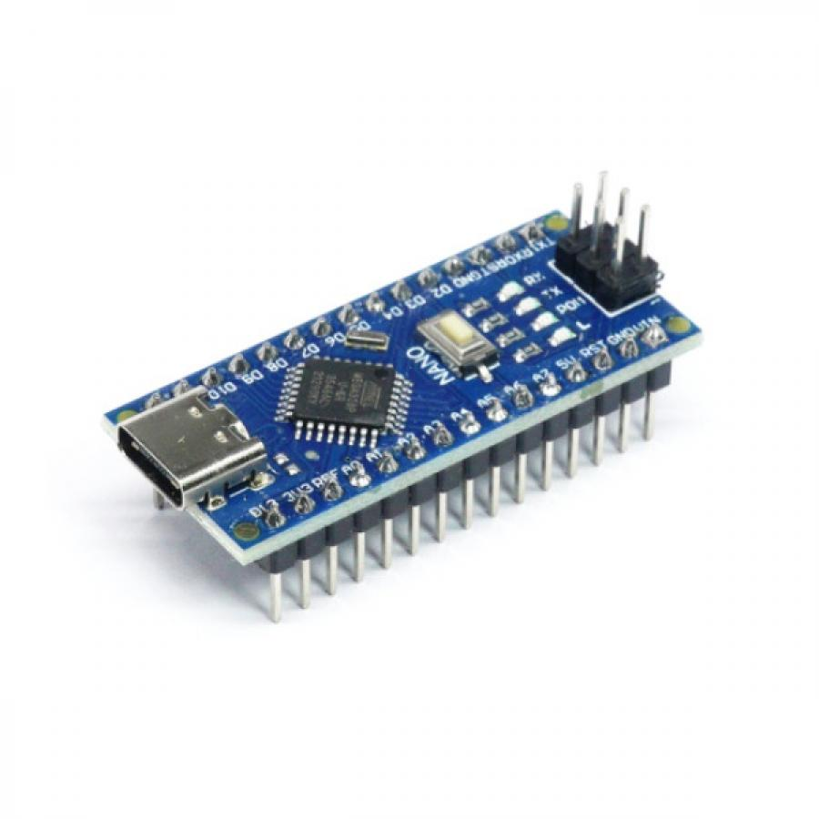
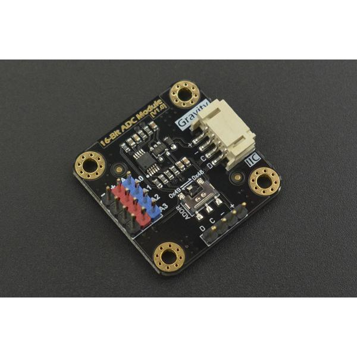
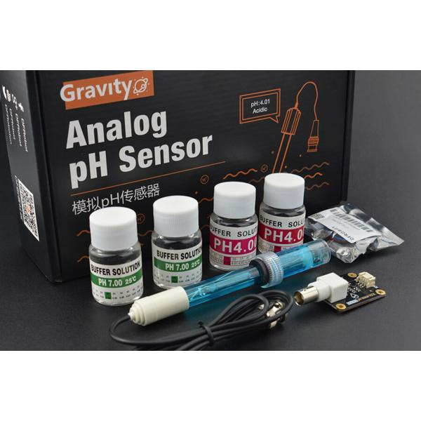
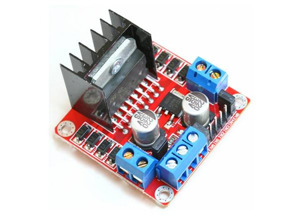
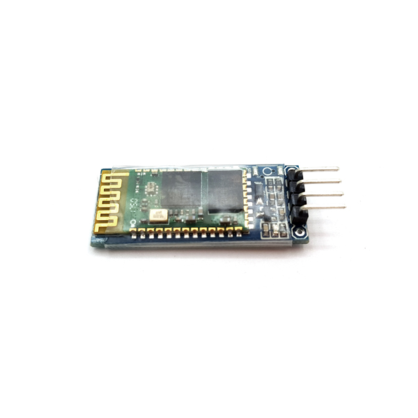
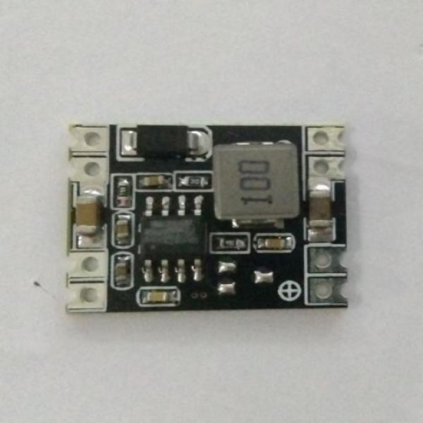
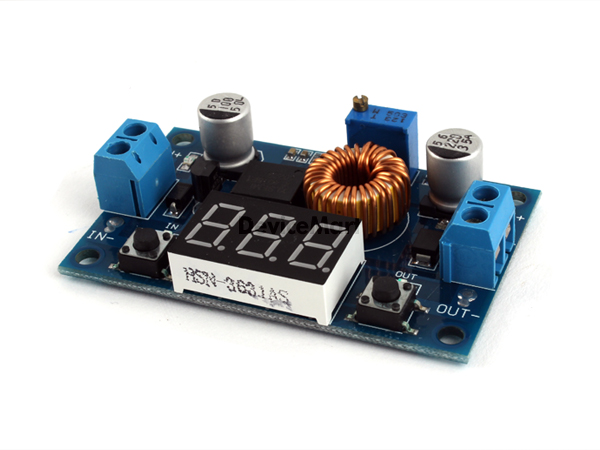
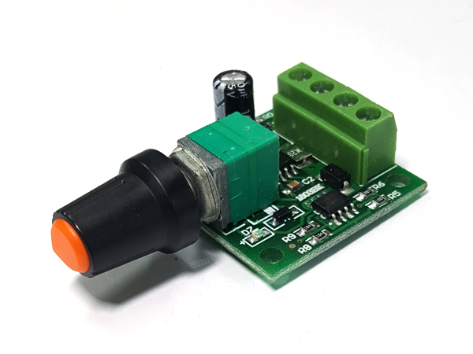
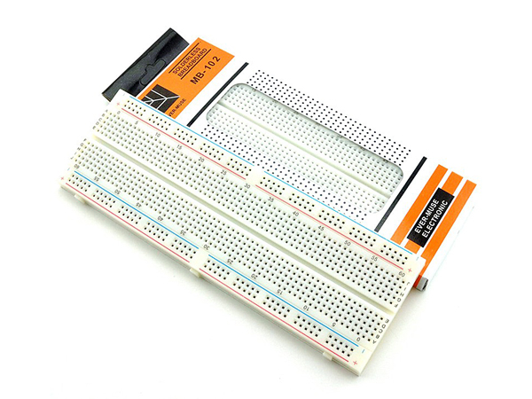
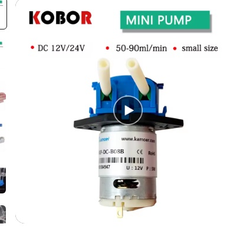

# AquaWiz 준비물 목록

## 디바이스마트 (주문번호: 2026052420462117683)

| # | 사진 | 부품명 | 수량 | 금액 |
|---|------|--------|------|------|
| 1 |  | [아두이노 나노 호환보드 V3.0 CH340 C타입](https://www.devicemart.co.kr/goods/view?no=15315999) | 1 | 5,500원 |
| 2 |  | [Gravity: I2C ADS1115 16-Bit ADC Module](https://www.devicemart.co.kr/goods/view?no=14592629) | 1 | 23,000원 |
| 3 |  | [Gravity: Analog pH Sensor/Meter Kit V2](https://www.devicemart.co.kr/goods/view?no=14593211) | 1 | 57,500원 |
| 4 |  | [2A L298 모터드라이버 모듈 (아두이노 호환)](https://www.devicemart.co.kr/goods/view?no=1278835) | 3 | 8,100원 |
| 5 |  | [블루투스 모듈 HC-06 (DIP) 펌웨어 v1.8](https://www.devicemart.co.kr/goods/view?no=1376882) | 1 | 5,500원 |
| 6 |  | [5V 고정 출력 강하형 DC-DC 3A 컨버터](https://www.devicemart.co.kr/goods/view?no=1321161) | 1 | 3,500원 |
| 7 |  | [FND 전압표시 XL4015 강하형 DC-DC 5A 가변 컨버터](https://www.devicemart.co.kr/goods/view?no=1321262) | 1 | 4,300원 |
| 8 |  | [PWM 12V 2A DC모터 속도 제어 컨트롤러](https://www.devicemart.co.kr/goods/view?no=1345967) | 4 | 8,000원 |
| 9 |  | [브레드보드 830핀 MB-102](https://www.devicemart.co.kr/goods/view?no=1322408) | 2 | 2,800원 |
| | | **디바이스마트 소계** | | **130,020원** |

> 결제일: 2026-05-24 / 결제방식: 카드

## AliExpress (주문번호: 1120797983932991)

| # | 사진 | 부품명 | 수량 | 금액 |
|---|------|--------|------|------|
| 10 |  | [연동 펌프 NKP-DC-S06B (12V, yellow)](https://ko.aliexpress.com/item/1005007628692389.html) | 4 | ₩21,680 |
| | | **AliExpress 소계** | | **₩21,680** |

> 주문일: 2026-05-24 / 결제수단: KakaoPay

## 총 합계

| 구매처 | 금액 |
|--------|------|
| 디바이스마트 | 130,020원 |
| AliExpress | 21,680원 |
| **합계** | **151,700원** |
