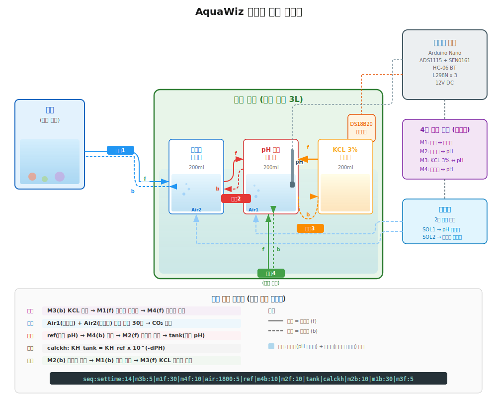
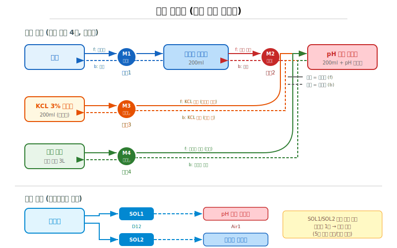

# AquaWiz 자동화 환경 구성

## 시스템 구성도



## 배관 연결



## 구성 요소

### 제어기 본체

| 구성 | 사양 |
|------|------|
| MCU | Arduino Nano V3.0 (ATmega328P) |
| pH 센서 | DFRobot SEN0161-V2 + ADS1115 16bit ADC |
| 온도 센서 | DS18B20 (위즈 탱크 내 침수) |
| 통신 | HC-06 블루투스 (9600 baud) |
| 모터 드라이버 | L298N x 3 |
| 전원 | 12V DC → Buck Converter (5V, 6V) |

### 연동 펌프 (4구, 모두 양방향)

| 펌프 | 경로 | 정방향 (f) | 역방향 (b) |
|------|------|------------|------------|
| 펌프1 (M1) | 수조 ↔ 수조물 비이커 | 수조 → 수조물 비이커 (샘플링) | 수조물 비이커 → 수조 (반환) |
| 펌프2 (M2) | 수조물 비이커 ↔ pH 측정 비이커 | 수조물 → pH 비이커 (측정 이송) | pH 비이커 → 수조물 (측정 후 반환) |
| 펌프3 (M3) | KCL 3% 비이커 ↔ pH 측정 비이커 | KCL → pH 비이커 (프로브 보관) | pH 비이커 → KCL 비이커 (저장수 배출) |
| 펌프4 (M4) | 위즈 탱크 ↔ pH 측정 비이커 | 참조수 → pH 비이커 (측정 이송) | pH 비이커 → 위즈 탱크 (참조수 반환) |

### 에어 공급 (2구 분배)

| 채널 | 위치 | 용도 |
|------|------|------|
| Air1 (솔레노이드1, D12) | pH 측정 비이커 | 참조수/수조수 탈기 |
| Air2 (솔레노이드2, D13) | 수조물 비이커 | 수조수 사전 탈기 |

- 기포기 1대에서 솔레노이드 밸브 2개로 교대 분배
- 동시 개방 불가 (기포기 소스가 하나이므로 교대 공급)

### 위즈 탱크

| 항목 | 사양 |
|------|------|
| 용량 | 3L |
| 내용물 | 참조 해수 (알려진 dKH 값) |
| 센서 | DS18B20 온도 센서 침수 |
| 비이커 | 200ml x 3개 (수조물, pH 측정, KCL 3%) |

모든 비이커는 위즈 탱크 안에 담겨 있어 참조수와 동일한 온도 환경을 유지합니다.

## 자동 측정 시퀀스

### 전체 흐름

```
① 수조수 샘플링
   펌프1 정방향: 수조 → 수조물 비이커 (m1f:30)

② KCL 저장수 배출
   펌프3 역방향: pH 비이커 → KCL 비이커 (m3b:초)

③ 동시 탈기 (30분, 5초 주기 교대)
   Air1 ↔ Air2 교대 공급 (air:1800:5)
   → pH 측정 비이커와 수조물 비이커의 CO₂를 동일하게 평형

④ 참조수 측정
   펌프4 정방향: 위즈 탱크 → pH 측정 비이커 (m4f:초)
   ref: 참조수 pH 측정 (64회 오버샘플링, ~8초)
   펌프4 역방향: pH 측정 비이커 → 위즈 탱크 (m4b:초) ← 참조수 반환

⑤ 수조수 측정
   펌프2 정방향: 수조물 비이커 → pH 측정 비이커 (m2f:초)
   tank: 수조수 pH 측정 (64회 오버샘플링, ~8초)
   펌프2 역방향: pH 측정 비이커 → 수조물 비이커 (m2b:초) ← 수조수 반환

⑥ dKH 계산
   calckh: KH_tank = KH_ref x 10^(-DeltaPH)

⑦ 수조수 원복
   펌프1 역방향: 수조물 비이커 → 수조 (m1b:초) ← 수조로 반환

⑧ 프로브 보관
   펌프3 정방향: KCL 3% → pH 측정 비이커 (m3f:초)
   → 프로브가 건조해지지 않도록 KCL 용액에 침수 보관
```

### 시퀀스 명령 예시

```
seq:settime:14|m1f:30|m3b:5|air:1800:5|m4f:10|ref|m4b:10|m2f:10|tank|m2b:10|calckh|m1b:30|m3f:5
```

| 단계 | 명령 | 동작 |
|------|------|------|
| 1 | `settime:14` | 시각 설정 (이력용) |
| 2 | `m1f:30` | 펌프1 정방향: 수조 → 수조물 비이커 (샘플링) |
| 3 | `m3b:5` | 펌프3 역방향: KCL 저장수 배출 |
| 4 | `air:1800:5` | 탈기 30분 (5초 교대) |
| 5 | `m4f:10` | 펌프4 정방향: 참조수 → pH 비이커 |
| 6 | `ref` | 참조수 pH 측정 |
| 7 | `m4b:10` | 펌프4 역방향: 참조수 → 위즈 탱크 반환 |
| 8 | `m2f:10` | 펌프2 정방향: 수조물 → pH 비이커 |
| 9 | `tank` | 수조수 pH 측정 |
| 10 | `m2b:10` | 펌프2 역방향: 수조수 → 수조물 비이커 반환 |
| 11 | `calckh` | dKH 계산 + 이력 저장 |
| 12 | `m1b:30` | 펌프1 역방향: 수조물 비이커 → 수조 반환 |
| 13 | `m3f:5` | 펌프3 정방향: KCL 3% 저장수 공급 (프로브 보관) |

## 온도 환경

위즈 탱크(3L) 안에 모든 비이커(200ml)가 담겨 있으므로:

- 참조수, 수조수 샘플, KCL 3%이 모두 동일 온도로 유지됨
- DS18B20이 위즈 탱크 수온을 측정하여 Nernst 온도 보상에 사용
- pH 전극의 온도 보상이 정확해짐
